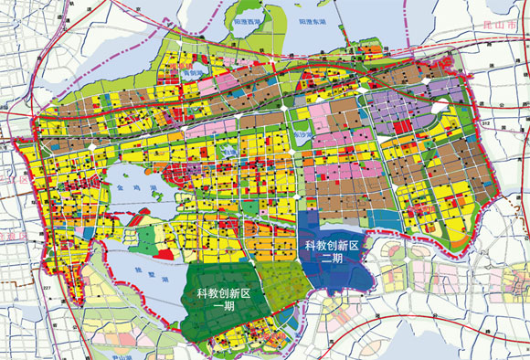
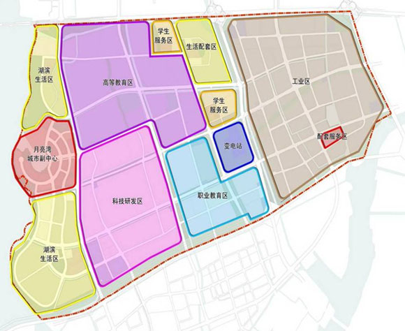
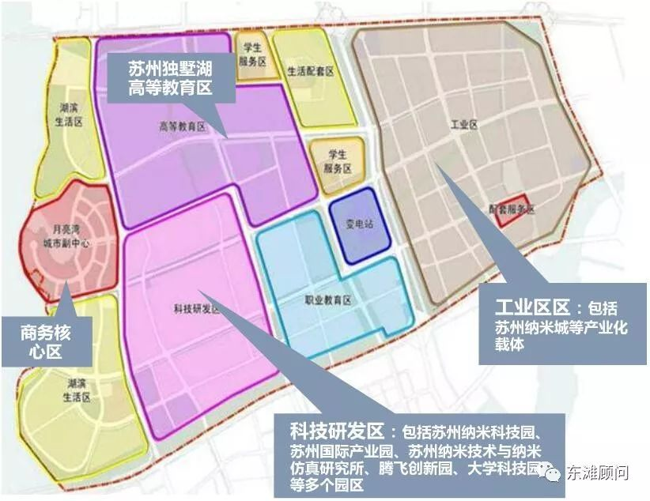
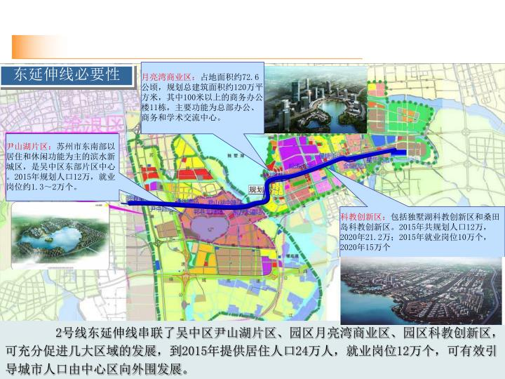
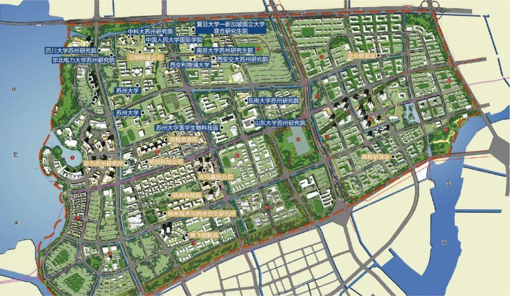
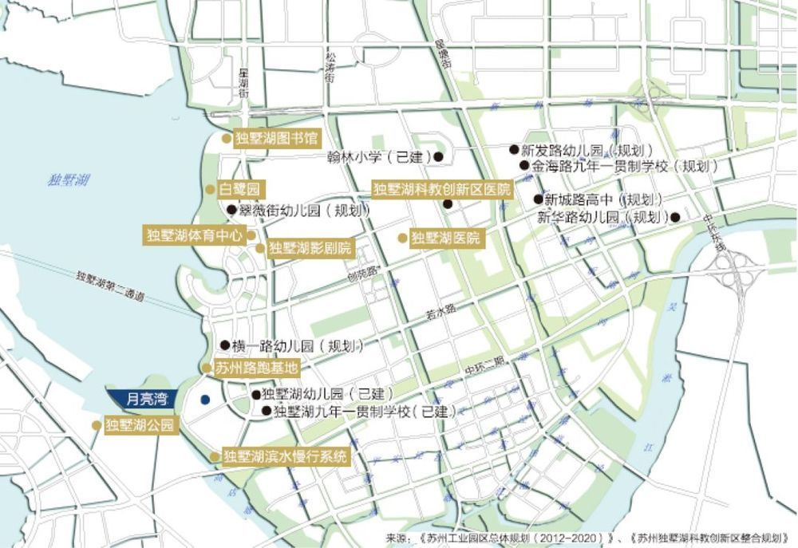
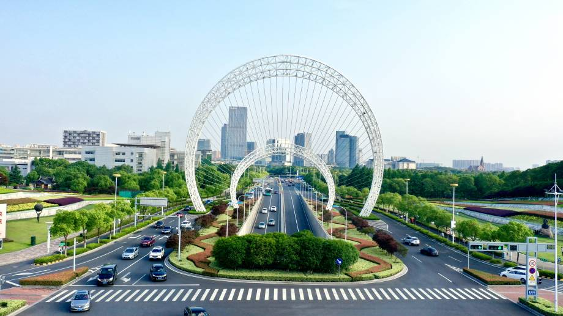
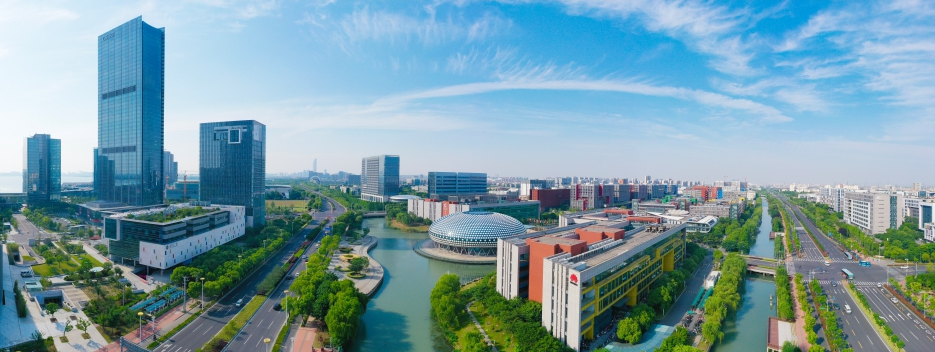
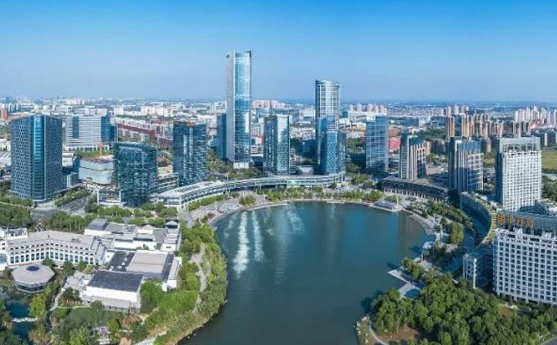
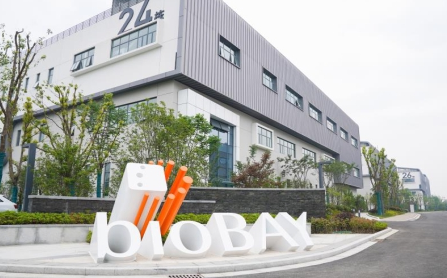

# 独墅湖高教区

* 独墅湖高教区
  * 别称
    * **独墅湖大学城**
    * **独墅湖高教区**
    * **独墅湖科教创新区**
    * **苏州独墅湖高等教育区**
  * 所属区域：
    * **苏州工业园区**

## 概述

苏州独墅湖科教创新区是苏州工业园区转型发展的核心项目，区域总规划面积约51.85平方公里，规划总人口40万人（其中学生规模约10万人），致力于构建高水平的产学研合作体系，重点发展生物医药、纳米技术应用、人工智能三大新兴产业。目标是建设成为创新资源集聚、新兴产业发达、高端人才荟萃、创新生态完善的科教协同创新示范区。

　　自2002年开发建设以来，苏州独墅湖科教创新区已初步建成集教育科研、新兴产业、生活配套为一体的现代化新城区，探索走出了一条以高端人才为引领、以合作办学为特色、以协同创新为方向的发展新路。吸引设立了牛津大学高等研究院（苏州）等31所中外知名院校，教职工约6400人，在校生人数7.85万人，留学生总数超3000人，获批全国首个“高等教育国际化示范区”。先后引进中科院苏州纳米所、中国医学科学院系统医学研究所等14家“国家队”科研院所，相继布局了华为苏州研发中心、微软苏州研发中心、协鑫中央研究院、西门子中国研究院等新型研发机构。

　　苏州纳米科技协同创新中心获得“2011计划”（即高等学校创新能力提升计划）首批认定；区域累计建成研发机构和平台247个（其中省部级80个），国家级孵化器7个、省级以上众创空间16个；建成了生物药分离纯化、微纳机电制造、软件评测等30多个公共技术服务平台，建立了“美国冷泉港会议亚洲分会”等20余个国际科技合作交流平台。历年累计专利申请量3.69万件，其中发明专利申请约占70%。区内拥有院士工作站、博士后科研工作和流动站38个，院士41人，国家重点人才工程计划132人，省市、园区领军人才1742人。7万多名从业人员中本科及以上学历者占比达75%以上。

　　依托苏州生物医药产业园、苏州纳米城、创意产业园、腾飞创新园、国家大学科技园、上市企业产业园等创新载体，新兴产业加速布局、快速成长，聚集了信达生物、同程艺龙、旭创科技、南大光电、苏大维格、康宁杰瑞、华为、思必驰信息科技等超4000家技术先进、具有良好产业化前景的企业。截至目前，区内中衡设计、金螳螂、南大光电、聚灿光电、再鼎医药、信达生物、同程艺龙、基石药业、百济神州、苏大维格、博瑞生物等上市企业18家（境外上市9家），今年已上市1家，即将上市企业1家，已进入江苏证监局辅导10家，上市后备梯队企业40余家。

　　按照“低碳、智能、生态、人文”的建设标准，独墅湖科教创新区全力打造绿色生态示范区，所有新建建筑按照绿色建筑标准设计实施，建成地下综合管廊近10公里，区域集中供热、供冷项目得到了较好的推广和应用；提倡绿色交通，以轨道交通建设为契机，不断完善公共交通系统，率先启动区域慢行系统规划建设，建成了公共自行车系统。公共配套日趋完善，以月亮湾商务区为代表的商业集聚区不断繁荣，人才公寓、学校、邻里中心、图书馆、体育馆、影剧院等一大批配套项目投入使用，为区域提供了和谐便利的人居环境，园林化、生态化、人文化城市形态已经形成。

## 科教创新区地理位置

图中的 除了已有的**科教创新区一期**，还有后期额外规划的**科教创新区二期**

## 科教创新区一期 = 首期

* 首期功能分区图
  * 
    * 带解释说明
      * 

## 交通

二号线地铁延伸线经过

## 独墅湖高教区内的学校和配套

* 学校
  * 汇聚了如中国科技大学、苏州大学、美国加州伯克利大学、乔治华盛顿大学、加拿大滑铁卢大学、澳大利亚莫纳什大学、新加坡国立大学、西交利物浦大学、加州大学洛杉矶分校等29所高等院校和职业院校为代表的世界级学区。
  * 
* 配套
  * 初等教育完善，顶级学府群聚，翰林幼儿园、翰林小学等初等教育学校拔地而起
  * 

## 历年大事记

[历年大事记 苏州独墅湖科教创新区](http://www.sipac.gov.cn/dept/szdshkjcxq/qygk/cxqdsj/)

* 旧的
  * 苏州独墅湖科教创新区2009年度大事记
    * 2009.4.2. 为进一步健全和完善科教创新区工委、管委会机构职能，切实推进独墅湖科教创新区建设发展进程，园区工委、管委会印发“关于明确苏州独墅湖科教创新区工委、管委会管理体制的通知” （苏园工〔2009〕52号），明确了科教创新区工委、管委会的功能定位、组织架构、经费来源等事宜。科教创新区工委、管委会为正处级建制，参照管委会机关局办管理，主要承担辖区内的综合管理工作，内部暂设三个处：综合处、规划建设管理处、科技服务处。
    * 2009.4.2. 园区工委、管委会印发“关于苏波等同志任职的通知” （苏园工〔2009〕56号），苏州独墅湖科教创新区工委、管委会主要领导班子组建成立。
    * 2009.4.2. 国家高性能计算中心（合肥）苏州分中心签约揭牌仪式举行。
    * 2009.5.4. 苏州市委常委、园区工委书记马明龙率园区相关部门负责人赴科教创新区调研，强调科教创新区是园区工作的“重中之重”，力争用3年左右时间将区域打造成为环境优美、配套设施完善、国内一流的具有产、学、研一体化特色的科教创新示范区。
    * 2009.5.22. 月亮湾首期建设项目举行开工典礼。作为区域商业核心板块的月亮湾地区占地面积72.6公顷，规划总建筑面积达114万平米。首期项目包括建屋紫金东方、月亮湾国际中心、教育发展大厦、置地酒店及商业街等，总建筑面积达47万平方米，总投资约34亿元人民币，功能涵盖商业设施、星级宾馆、酒店式公寓、高级写字楼等领域，这批重点商业项目的开发建设，对于进一步改善科教创新区商务环境、完善城市功能、提升城市品位、发展现代服务业具有重要意义。
    * 2009.5.24. 为迎接园区开发建设15周年，科教创新区首批建设的东南大学国家大学科技园（苏州）、西安交通大学国家大学科技园（苏州）、苏州大学科技园（园区）三家大学科技园正式启动运作。
    * 2009.5.24. 苏州工业园区与中国电信股份有限公司苏州分公司、苏州工业园区与英特尔（中国）有限公司战略合作签约暨融合通信开放实验室启动仪式在科教创新区举行。
    * 2009.6.6. 东南大学苏州研究院校区落成仪式举行。江苏省委书记梁保华与东南大学党委书记胡凌云共同为东南大学苏州研究院校区揭牌。江苏省委常委、苏州市委书记王荣向东南大学校长易红交送了新校区落成启用的钥匙。苏州市委副书记、市长阎立，苏州市委常委、园区工委书记马明龙等出席了仪式。
    * 2009.6.6. 由苏州大学与香港凤凰卫视集团合作组建的苏州大学凤凰传媒学院正式挂牌成立。
    * 2009.6.15. 我国高维形象几何仿生信息学理论创始人王守觉院士率领其仿生信息技术团队正式落户区内。
    * 2009.6.17全国人大常委会副委员长、中科院院长路甬祥在江苏省人大副秘书长邵伟明，江苏省科技厅厅长朱克江等领导陪同下莅临我所视察指导工作。
    * 2009.6.23.  ChinaBio ® Accelerator 和EBD集团在上海举办了中国首届ChinaBio ® 合作论坛。生物纳米园携手园内爱斯鹏药物研发、派格生物、吉玛基因、时代楷模、艾方生物、国镝医药、浩欧博生物、广泰生物等8家企业参加了此次论坛，其中7家企业还参加了会议现场的路演环节。
    * 2009.7.3. 中国科学技术大学苏州科技园宣告成立，中科大校长侯建国和苏州市委副书记、市长阎立共同为科技园揭牌，苏州市委常委、园区工委书记马明龙，苏州副市长王鸿声出席签约揭牌仪式。
    * 2009.7.9. 苏州市委常委、园区工委书记马明龙率园区相关部门负责人赴独墅湖科教创新区调研，强调科教创新区要切实按照“人才新高地、科技新硅谷、城市副中心、创业首选区”的发展目标，全力推动产业高地、创新高地和人才高地建设。
    * 2009.7.11 苏州市委常委、园区工委书记马明龙主持召开会议，研究推进桑田岛地区规划建设事宜。会议原则同意该规划成果，并正式明确桑田岛区域约9平方公里作为科教创新区二期发展用地，包括教研孵化区、新兴产业区、旗舰企业区和预留发展区四个区域。
    * 2009.7.21. 科教创新区在西交利物浦国际会议中心首次举办大型科技、人才、金融政策宣传推进会，参会企业300多家，旨在通过进一步宣传好各项扶持政策，切实发挥政策的促进和引导作用，推动科技型中小企业加快发展。
    * 2009.7.24. 南京大学（苏州）高新技术研究院在科教创新区正式成立。南京大学党委书记洪银兴，苏州市委常委、宣传部长徐国强，市委常委、园区工委书记马明龙等出席签约暨揭牌仪式。
    * 2009.8.1. “装备制造苏州论坛周”在区开幕，国内装备制造领域权威专家、科研人员、企业代表320余人参加了此次论坛活动，其中包括7位中国科学院、中国工程院院士。专家们就先进制造、高档数控机床等领域中的基础学科、关键技术和产业发展趋势等进行了交流与探讨。
    * 2009.8.25. 由生物纳米科技园与美国知名咨询机构ChinaBio合作举办的第二届“BioBay Investor Forum”（BioBay创业投资论坛）在区拉开帷幕，吸引了200余位来自国内早期生物科技公司的企业家与来自全球50余家的风险投资机构参与。
    * 2009.9.1. 区内第一所幼儿园——翰林幼儿园正式开园，迎来首批130名幼儿学生。
    * 2009.9.6. 由中国人民大学与苏州市合作共建的中国人民大学国际学院（苏州研究院）在区举办隆重的开学典礼，并迎来了首批400多名研究生和博士生。中国人民大学校长、国际学院（苏州研究院）院长纪宝成，省委常委、市委书记蒋宏坤等出席典礼，并共同为中国人民大学应用经济学博士后流动站等揭牌。中国人民大学党委书记程天权，市委副书记、市长阎立，市人大常委会主任杜国玲，市政协主席王金华等出席典礼。
    * 2009.9.11. 第四届亚洲EA（企业应用软件及IT服务）论坛举行，共有来自日本、韩国、以色列等多个国家和地区的300位软件及IT服务代表参加。
    * 2009.9.12. 园区与西安交大正式签署协议，联合建设西安交通大学苏州研究生院。
    * 2009.9.19. 邻里中心翰林大厦落成迎客，成为了科教创新区重要的生活服务中心。
    * 2009.9.22. 园区管委会印发“关于成立科教创新区理事会的通知”（苏园管〔2009〕48号），明确了科教创新区理事会是由入驻区内的各机构联合组建，旨在充分发挥对区域科技发展、教学培训、研发及创新能力跨越提升的参谋、咨询作用。首届理事会由18名理事组成，园区工委副书记、管委会副主任、科教创新区工委书记施玉初担任理事长，管委会主任苏波、常务副主任叶峰等8人为副理事长，其余9人为理事。
    * 2009.9. 为进一步改善区内人才住房条件，优化区域居住环境，总建筑面积20万平方米的翰林缘二期竣工落成。
    * 2009.10.15. 由科教创新区内各类科研创新机构、人才培养机构、人才服务机构在平等自愿基础上组成的人才服务联盟正式宣告成立。该联盟将共同打造一个以生物医药、IT软件外包、纳米新材料、游戏动漫等产业为主导的人才服务平台，促进区域内人才与产业的健康发展。
    * 2009.10.18. 第二届“中国名校苏州创新合作论坛暨科技成果对接交流会”在区举行，本次交流会主题为：聚焦科技创新、促进产业发展，共有来自全国40多所院校的领导、院士、教授和专家以及800家苏州本地企业、200家外地企业代表参加了交流会。
    * 2009.10.22. 入选中组部“千人计划”的3人全部落户在科教创新区，分别是网经科技（苏州）有限公司刘继明、中科院苏州纳米研究所崔铮和苏州大学廖良生。
    * 2009.10.24.  苏州独墅湖科教创新区科技合作推介会在英国利物浦大学举行，来自英国利物浦大学、利物浦科技园、利物浦创意园、相关公司CEO、新闻媒体代表及部分留学生参加了推介会。通过多方面的交流沟通、洽谈合作，积极推动科技成果转化及相关合作事宜，同时在人才培养、学校发展等方面进一步加强交流。
    * 2009.10. 腾飞创新园正式启动建设，一期A区开工面积5.2万平方米。
    * 2009.11.5. 为期两个月的苏州独墅湖科教创新区摄影大赛顺利落下帷幕，所有获奖作品，将陆续安排在区内各主要单位进行巡展。本次活动得到了院校师生及各界人士的积极相应与大力支持，活动期间，共收到参赛作品近1200张，生动展现了科教创新区多年来开发建设的努力与成就。
    * 2009.11.9. 科教创新区首届理事会第一次会议召开，园区管委会主任杨知评为首届理事会成员颁发聘书，会议审议并原则通过了《科教创新区理事会章程》。
    * 2009.11.26. 苏州大学唐仲英血液学研究中心揭牌仪式在独墅湖校区隆重举行，江苏省委书记梁保华与美国唐氏工业公司董事长、唐仲英基金会董事长唐仲英先生共同为中心揭牌。
    * 2009.12.2. 苏州独墅湖科教创业园（运行主体：苏州工业园区教育发展投资有限公司）获批省级高新技术创业服务中心。
    * 2009.12.4. 武汉大学原校长刘经南院士领衔的“多模多频卫星导航射频接收芯片” 等3个项目被认定为苏州独墅湖科教创新区首届“科教创新重点工程”项目，并享受相关优惠政策。
    * 2009.12.9. 筹建三年的中国科学院苏州纳米技术与纳米仿生研究所正式通过验收。全国人大常委会副委员长、中科院院长路甬祥出席了验收会议，会议审议通过了中科院苏州纳米所验收意见，并宣布了纳米所领导班子成员，由杨辉任所长，园区工委副书记、管委会副主任、科教创新区工委书记施玉初、刘佩华等3人任副所长。
    * 2009.12.10. 被授予国家“海外高层次人才创新创业基地”苏州独墅湖科教创新区分基地。
    * 2009.12.18. 生物纳米园企业与苏州大学医学部“校企联盟”合作签约暨对接交流会活动成功举办。通过此次签约，进一步深化了双方在平台共享、项目攻关、人才培养、氛围营造等方面的实质性合作。园区管委会副主任、科教创新区管委会主任苏波、苏州大学副校长路建美等出席了签约仪式。
    * 2009.12.19. 中科院苏州产业技术创新与育成中心揭牌仪式举行。
    * 2009.12.22. 苏州工业园区召开《苏州工业园区生态规划》、《科教创新区生态型控制性详细规划》汇报会，省住房和城乡建设厅副厅长张泉应邀到会作报告并就做好园区生态规划工作提出指导性意见，园区管委会主任杨知评、园区工委副书记、管委会副主任、科教创新区工委书记施玉初等出席了会议。
    * 2009.12.28． 连接独墅湖科教创新区与火车站的快速公交2号线正式开通，线路全长22公里，全程运营时间约为45分钟。线路开通后，乘公交从独墅湖到火车站车程缩短1个小时。
    * 2009.12.28．园区中小企业服务中心正式在区运转，目前服务大厅共设立11个服务窗口，为中小企业提供快速、及时的综合服务，加速企业的快速成长。
    * 2009.12.31. 区内第一家五星级国际会议酒店——独墅湖会议酒店顺利竣工，并于次年元月投入使用。该酒店与闻名世界的美国冷泉港实验室共签合作协议，成为美国冷泉港实验室唯一的亚洲分会场。

## 高教区掠影

