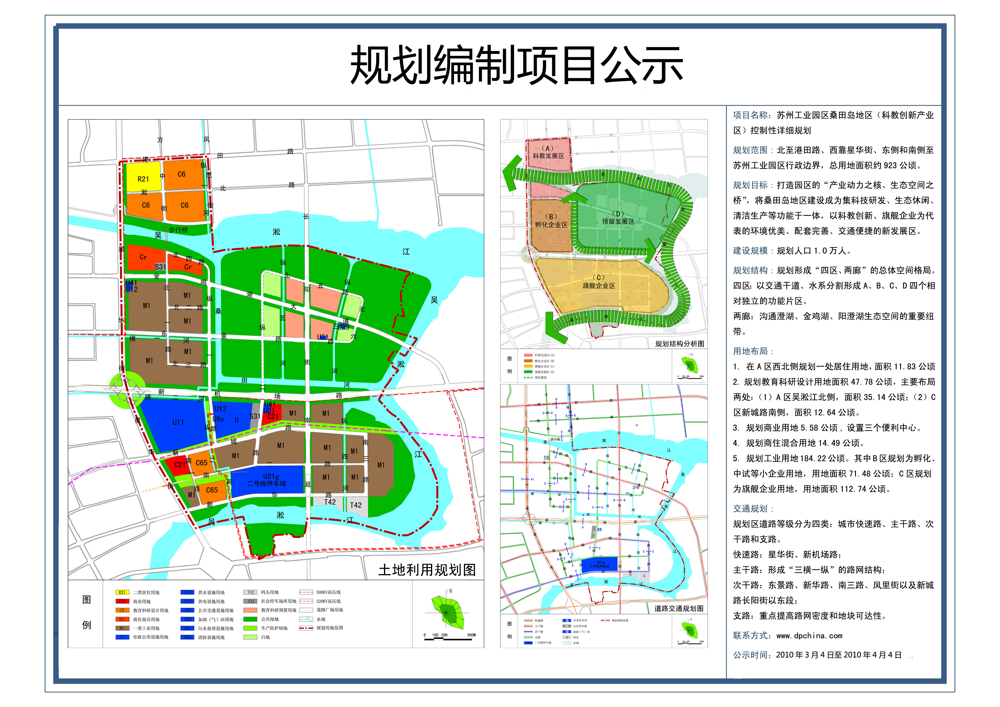

# 桑田岛

* 桑田岛=桑田岛地区
  * 号称
    * `苏州硅谷`
  * 地理位置
    * 苏州工业园区东部
    * 星华街以东、吴淞江西南地区
    * 独墅湖板块最东边的角落
    * 离吴中区甪直区域很近
  * 规划用地 包含
    * 教育用地
    * 居住用地
    * 部分商业配套用地
    * 白地

## 桑田岛规划

* 苏州 工业园区 独墅湖高教区 桑田岛 规划 公示
  * 
